# 軍儀 (Gungi) 駒の動き図 — エンジン生成

<!-- GENERATED FILE: do not edit by hand. -->

**このファイルと `pieces/*.svg` はエンジンから自動生成している。手で編集しないこと。**
`packages/gungi-engine/src/diagrams.ts` が各駒を空の盤に 1〜3 段目で置き、エンジンの移動定義（`MOVE_RULES` / `ruleSquares`）から
そのまま描く。図とエンジンが食い違うと `diagrams.spec.ts` が失敗する。ルール本文は [GUNGI_RULES.md](GUNGI_RULES.md) §5。

再生成（リポジトリのルートで実行）:

```sh
UPDATE_PIECE_DIAGRAMS=1 npx vitest run packages/gungi-engine/src/diagrams.spec.ts
```

## 読み方

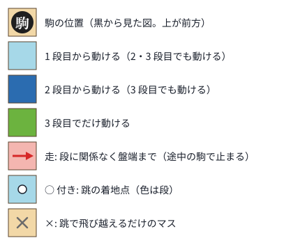

- 9×9 の盤全体に、黒の駒を 1 つだけ置いた図。上が前方、右が自分から見て右。白は盤上で 180° 回転して適用する（§2.2）。
- 1 枚の図に 1〜3 段目をまとめて描く。マスの色は、そのマスへ動けるようになる最も低い段（段の範囲は累積。§5.2）。
  - 水色 = 1 段目から、青 = 2 段目から、緑 = 3 段目でだけ。
  - 赤いマスと赤い矢印 = 走（大・中）。段に関係なく盤端まで。
  - 白い ○ 付きのマス = 跳の着地点。灰色の × = 跳で飛び越えるだけのマス（着地はできない）。
- 空の盤上での範囲。実際の対局では途中の駒による遮断（§5.1）と飛び越えの高さ制限（§5.4）がかかる。
  跳では手前の着地点も、それより先の着地点に対して飛び越えるマスになる。
- 弓の段別の範囲は公式の段別図と照合済み。それ以外の駒の 2・3 段目は §5.2 の拡張規則による（⚠ R-1、GUNGI_RULES.md §13）。
- 各駒の「動き」の行は 1 段目の動き（エンジンの移動表から生成）。2 段目で歩の範囲 +1・跳の着地点がレイの先へ 1 マス、3 段目でさらに +1。

## §5.3.1 帥 (`marshal`)

1 枚。動き: 歩1 前・後・左・右・左前・右前・左後・右後

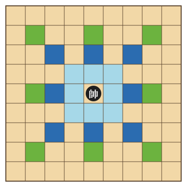

## §5.3.2 大 (`general`)

1 枚。動き: 走 前・後・左・右 / 歩1 左前・右前・左後・右後

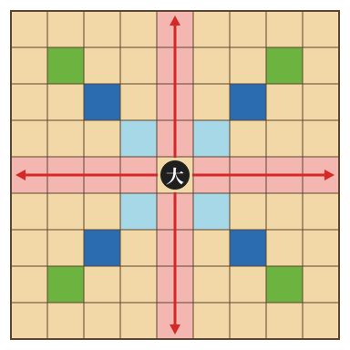

## §5.3.3 中 (`lieutenant`)

1 枚。動き: 走 左前・右前・左後・右後 / 歩1 前・後・左・右

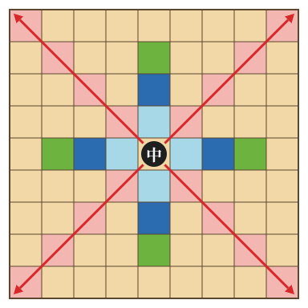

## §5.3.4 小 (`major`)

2 枚。動き: 歩1 前・左前・右前・左・右・後

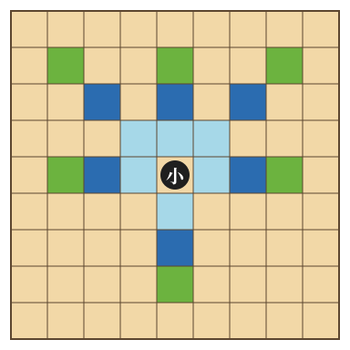

## §5.3.5 侍 (`samurai`)

2 枚。動き: 歩1 前・左前・右前・後

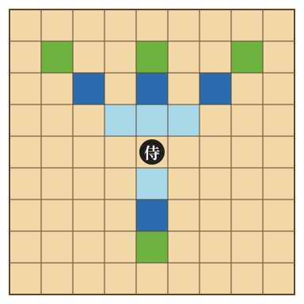

## §5.3.6 槍 (`lancer`)

3 枚。動き: 歩2 前 / 歩1 左前・右前・後

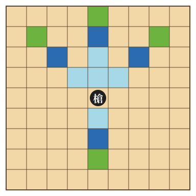

## §5.3.7 馬 (`knight`)

2 枚。動き: 歩2 前・後 / 歩1 左・右

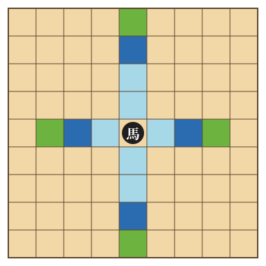

## §5.3.8 忍 (`shinobi`)

2 枚。動き: 歩2 左前・右前・左後・右後

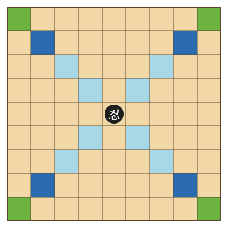

## §5.3.9 砦 (`fortress`)

2 枚。動き: 歩1 前・左・右・左後・右後

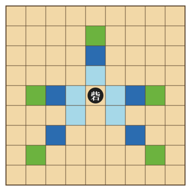

## §5.3.10 兵 (`pawn`)

4 枚。動き: 歩1 前・後

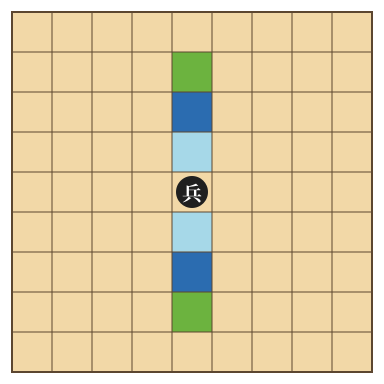

## §5.3.11 砲 (`cannon`)

1 枚。動き: 跳 (0,+3) / 歩1 左・右・後

3 段目の範囲を盤に収めるため、駒を盤の中央より 1 段列手前に置いて描いた。

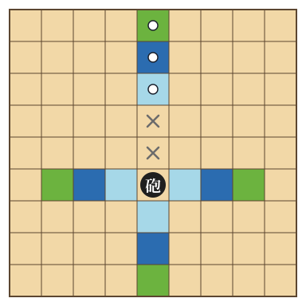

## §5.3.12 弓 (`archer`)

2 枚。動き: 跳 (−1,+2)・(0,+2)・(+1,+2) / 歩1 後

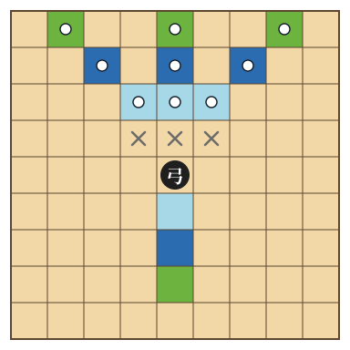

## §5.3.13 筒 (`musket`)

1 枚。動き: 跳 (0,+2) / 歩1 左後・右後

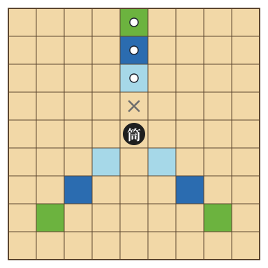

## §5.3.14 謀 (`tactician`)

1 枚。動き: 歩1 左前・右前・後

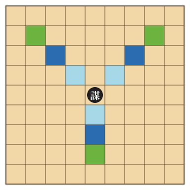
